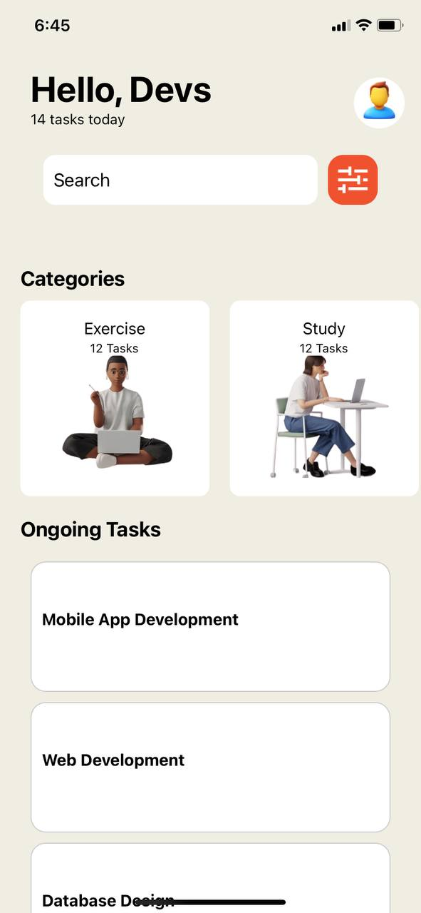

# rn-assignment3-11297233

## Components

### App
- The main component of the application. It renders the overall layout, including the header, search bar, categories, and task list.

### Tasks
- A list of predefined tasks, each with a title.

### Categories
- Horizontal scrollable categories section, displaying various categories like Exercise, Study, Work, Hobbies, etc., each with an associated image and task count.

## Usage

### TextBox
- **Description**: A header component displaying a greeting message and the number of tasks for the day. It also includes a user profile image and a hidden text input.

### SearchBoxContainer
- **Description**: Contains a search bar for users to search tasks and a search icon.

### Categories
- **Description**: Displays various categories in a horizontal scroll view. Each category shows a title, task count, and an image.

### TaskList
- **Description**: A vertical list of tasks, displayed using a `FlatList`. Each task has a title.

